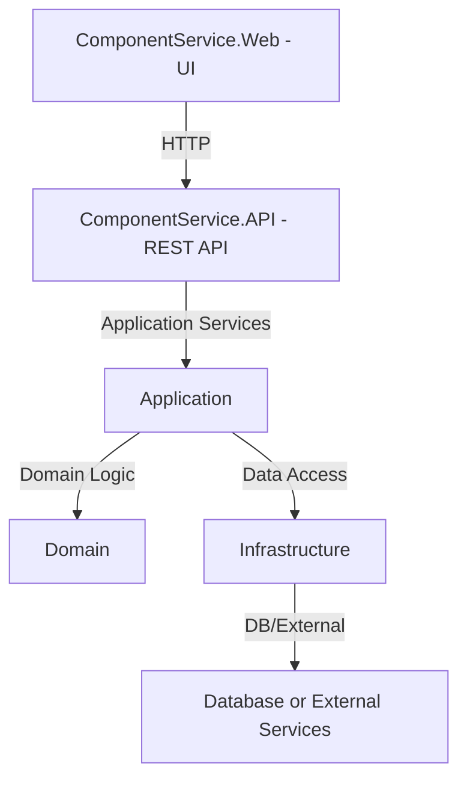

# CYRetailIMS
Ying Charoen Retail Inventory Management System


---

## Project Structure

```
CYRetailIMS/
├── src/
│   ├── Application/
│   ├── ComponentService.API/
│   ├── ComponentService.Web/
│   ├── Domain/
│   └── Infrastructure/
├── tests/
│   ├── Application.Test/
│   ├── Domain.Test/
│   └── Integration.Test/
├── .github/
│   └── copilot-instructions.md
├── CYRetailIMS.sln
└── README.md
```

---

## Architecture Diagram



---

## Description
CYRetailIMS is a modular .NET solution for retail inventory management, following clean architecture principles. It separates UI, API, business logic, domain, and infrastructure for maintainability and scalability.

---

## Getting Started
- .NET 7 SDK required
- See each project folder for specific setup instructions

---

## Contributing
- Follow the code style and architecture described in `.github/copilot-instructions.md`
- Add tests for new features in the `tests/` directory

---

## License
This project is licensed under the APPSBOXS License - see the LICENSE.md file for details